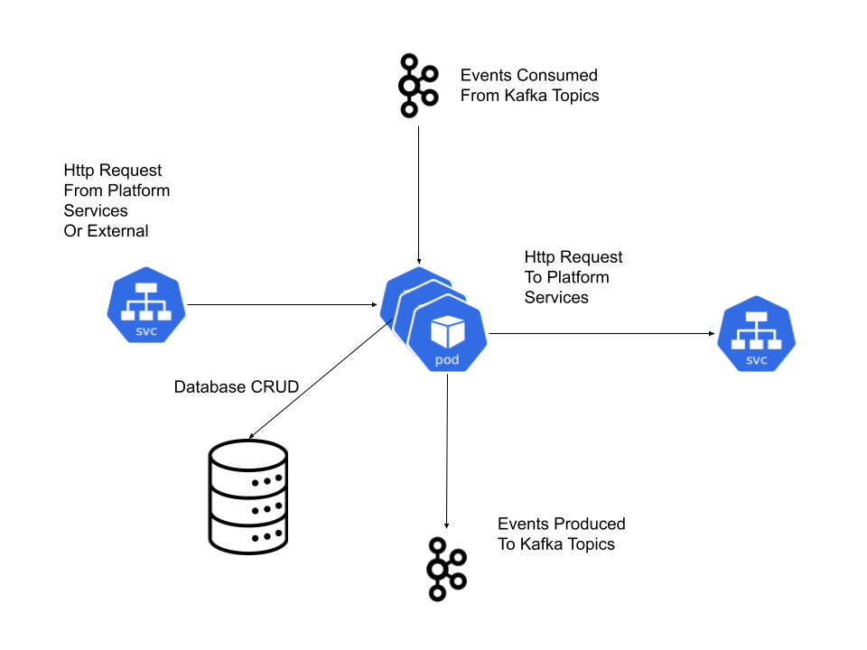
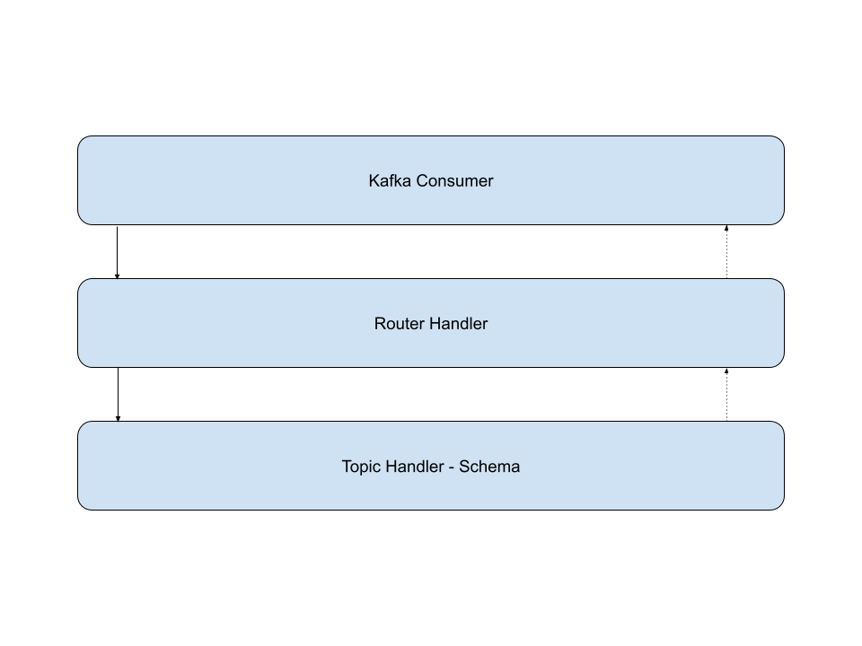

# Architecture and design

TODO Create PlantUML diagram

The components on this repository provides entrypoint through
api service at /api/hmsidm/v1/todos (TODO with your service) and
consuming kafka topics (todo-created) (TODO update list for your service).

(not added yet) The components on this repository make requests to `/api/rbac/v1`
services (TODO update with your own list) and produce messages into
kafka topics (todo-created) (TODO update list for your service).

The persistency is stored in postgresql database.

## Design blocks

### Application blocks

TODO Create a PlantUML diagram

The first level break down the application components in
`ApplicationService` components which could be:

- Some echo framework API implementing public and private API
  endpoints.
- TODO An echo framework exposing the metrics.
- A kafka consumer which is running into the background and
  processing the events received.
- Any other backgroun go routine that is executed by our
  application.

Here the scope is delimited to start and gracefully stop
the application block, no more, no less.

> It is important the graceful shutdown when the
> `SIGTERM` signal is received; this could happens
> in scenarios such as the number of replicas is reduced,
> because the kubernete scheduled decide to move the workload
> to another node, because the node where it is running
> is accordoned.

### Service API blocks

The service API blocks are break down into the below:

- **Router**: It wires the middlewares and handlers. Some parte is
  partially generated by oapi-generator, but the global and group
  middlewares are wired on this component. The granularity that is
  used into the repository is one router per openapi specification
  file. Tha main router combine the public and private API to
  compose the router, and it assign a specific set of middlewares
  to each group. TODO The metrics would define a new openapi spec
  file, and would be exposed; I thought to use the private api
  for this, but given that the port where the metrics are exposed
  is different, and the path is determined by the clowder
  configuration, this made me think in using a separate router,
  a separate openapi specification, and its own echo service
  instance.
- **Http Handler**: Are generated by the oapi-generator as a wrapper
  that call the specific `Service` that represent our API. This
  wrapper depends on the golang framework selected. In this way
  it is got a framework abstraction.
- **Interactor**: The only responsibility of this component is to
  translate the API request payload to the internal data model.
  The adviced granularity is one interactor per API resource; this
  is, for the `/todos` we have only one interactor.
- **Repository**: It represents the interactions with the data
  model, and it uses to define the CRUD operations on the
  database. For interacting with the database is used `gorm`
  framework.
- TODO (below a declaration of intentions) **Clients**: It represents
  the connection with a third party service that could need our
  application. The advice is to define a package per client, which
  could make easier to export later in a golang package.
- **Kafka Producer**: Represent a producer for a specific kafka
  topic. It abstracts the communication with it.
  TODO it is provided a generic kafka producer, but make sense
  to have a specific instance per message or group all the
  messages to produce in an interface, to group the responsibility
  of this component, for providing specific producer logic per
  message, to provide an interface that can be mocked
  for the unit tests, making them easier to create, and it allows
  to depends on interfaces. TODO Check if the general producer
  function is validating the outgoing event messages against the
  event schema that represent (check the contract).
- **Presenter**: This is the oposite to the interactor and translate
  from the data model to the API response.

All the above components are decoupled in small and well defined
responsibilities into the code, letting to create easily unit
tests, and mock components.

### Kafka blocks

The Kafka blocks are break down into the below:

- **Kafka Consumer**: it represents the consumer run loop
  and the kafka client library.
- **Router Handler**: it represents the kafka consumer routing
  which dispatch the received message from the subscribed
  topics to the specific handler.
- **Topic Handler - Schema**: it represents a handler for a
  specific topic message.

The Kafka messages received are validated with its schema definition.

- 1 topic has 1 message schema associated.
- 1 topic has 1 consumer handler associated that process the event.
- Every event received has the headers below:
  - x-rh-identity: The same as the x-rh-identity http header.
  - x-rh-insight-request-id: The same as the x-rh-insights-request-id
    and it is used for distributed tracing of the logs.
