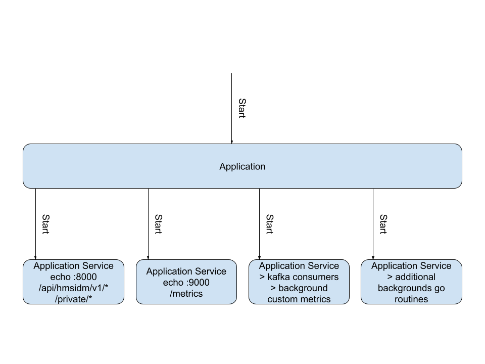
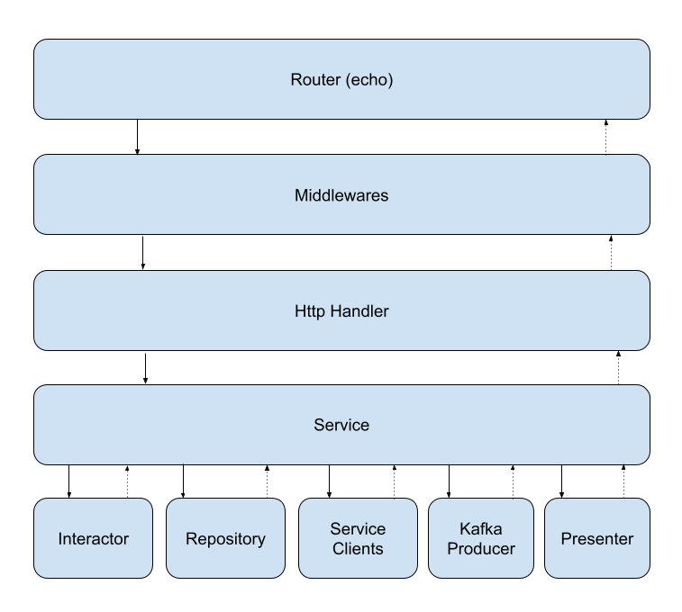

# Architecture and design

The components in this repository provide our service API
`/api/idmsvc/v1...`, servicing requests from clients including:

- Web frontend (registration workflow)
- IPA servers (registration workflow, domain data updates and JWK
  refresh)
- VM (enrollment workflow, where VM asks for domain info and join
  authority)

Data persistence of domain information and join authority signing
keys is stored in PostgreSQL database.

## Design blocks

### Application blocks

The first level of the application is the Go echo HTTP 
framework which is used to provide several HTTP APIs:

- The public service API.
- Metrics API for Prometheus metrics publication.
- Liveness and readiness probes.

Here the scope is delimited to start and gracefully stop the
application block, no more, no less.

> It is important the graceful shutdown when the
> `SIGTERM` signal is received; this could happens
> in scenarios such as the number of replicas is reduced,
> because the kubernete scheduled decide to move the workload
> to another node, because the node where it is running
> is accordoned.

### Service API blocks

The service API blocks are break down into the below:

- **Router**: It wires the middlewares and handlers. Some parte is
  partially generated by oapi-generator, but the global and group
  middlewares are wired on this component. The granularity that is
  used into the repository is one router per openapi specification
  file. Tha main router combine the public and private API to
  compose the router, and it assign a specific set of middlewares
  to each group. TODO The metrics would define a new openapi spec
  file, and would be exposed; I thought to use the private api
  for this, but given that the port where the metrics are exposed
  is different, and the path is determined by the clowder
  configuration, this made me think in using a separate router,
  a separate openapi specification, and its own echo service
  instance.
- **Http Handler**: Are generated by the oapi-generator as a wrapper
  that call the specific `Service` that represent our API. This
  wrapper depends on the golang framework selected. In this way
  it is got a framework abstraction.
- **Interactor**: The only responsibility of this component is to
  translate the API request payload to the internal data model.
  The adviced granularity is one interactor per API resource; this
  is, for the `/todos` we have only one interactor.
- **Repository**: It represents the interactions with the data
  model, and it uses to define the CRUD operations on the
  database. For interacting with the database is used `gorm`
  framework.
- **Presenter**: This is the oposite to the interactor and translate
  from the data model to the API response.
- **Clients**: It represents the connection with a third party
  service that our application depends on.  Examples include
  ConsoleDot RBAC and Pendo.

All the above components are decoupled in small and well defined
responsibilities into the code, letting to create easily unit
tests, and mock components.
