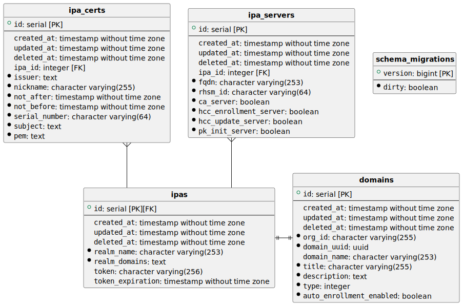

# Database model

Every entity repeat the `gorm.model`:

- **id**: the primary key for the entity.
- **created_at**: timestamp filled by gorm when a new record is created
  for the entity.
- **updated_at**: timestamp filled by gorm when the record is updated.
- **deleted_at**: (default NULL) timestamp filled by gorm when a soft
  delete is processed.

## domains

It represents to any domain that can be managed by idm-domains-backend
micro-service.

- **org_id**: The organization id that this domain belongs to.
- **domain_uuid**: The internal identifier for a domain. It is a
  unique value into the system.
- **domain_name**: The domain name represented by this entity.
- **title**: A human readable description for this
  domain entry.
- **description**: A human readable description for this
  domain entry.
- **type**: Identify the sort of domain represented by this
  entry.
- **auto_enrollment_enabled**: If it is true, the auto-enrollment
  is enabled for this domain; false, no host will be enrolled for
  this domain when they are created.

## ipas

It does not contains additional information, but it represent the
logical inherited entity `domains`. It represents the each ipa domain.

- **realm_name**: The kerberos realm name that is managed by this
  IPA domain.
- **realm_domains**: TODO.

TODO Do we need a flag to indicate that the domain has been
registered to update the data after the first update?

## ipa_certs

TODO Does this require an item_order to retrieve the list
of certificates in the same order?

- **ipa_id**: Foreign key to the `ipa` entity related with
  this certificate.
- **nickname**: TODO
- **issuer**: The certificate issuer field for this certificate.
- **subject**: The subject field for this certificate.
- **serial_number**: Unique identifier of this certificate for
  the given issuer.
- **not_before**: Timestamp included that indicate the begin
  of validity for this certificate.
- **not_after**: Timestamp included that indicate the end
  of validity for this certificate.
- **pem**: The content of the certificate using PEM format as a string.

## ipa_servers

This entity represent the servers associated to an IPA domain.

- **ipa_id**: Foreign key that point out to the IPA entity which
  this record belongs to.
- **fqdn**: The full qualified domain name for the server host
  that belongs to the IPA domain. This value cannot be longer than
  253 characters.
- **rhsm_id**: A uuid value which identify the host into RHSM system.
- **ca_server**: Boolean value that indicate if the server is acting
  as a ca_server.
- **pk_init_server**: A boolean value that indicate if the server
  is acting as a PKI server.
- **hcc_enrollment_server**: A boolean value that indicate if this
  server has the hcc enrollment agent enabled.
- **hcc_update_server**: A boolean value that indicate if this server
  is enabled to run the `hcc-ipa update ...` command.
