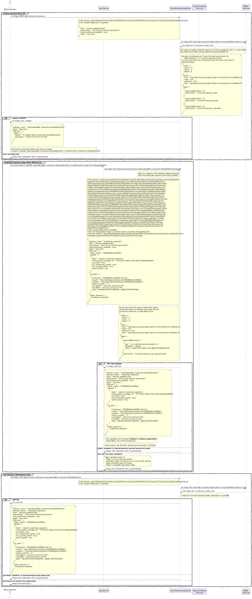

# Registration process

> Simplification: Between the external request and our service
> the X-Rh-Identity and X-Rh-Insights-Request-Id headers
> are aggregated to the request that the micro-service receive,
> authorizing the request.

* (1) The Administrator create a new domain.
  So a `POST /api/hmsidm/v1/domains` request is sent, using
  a user credentials with `hmsidm:domains:write` permission.
* (2) idm-domains-backend request ACL for the current x-rh-identity.
* (3) rbac service return the ACL list.
* (4) with `hmsidm:domains:write` permission checked, intent to create
  the domain entry for the organization and return the resource
  (here is the only moment the token is returned).
  If RBAC validation fails, return **403 Forbidden**.
* (5) Administrator run the `ipa-hcc register <domain_uuid> <token>`
  as indicated into the UI step indications.
* (6) A `PATCH /api/hmsidm/v1/domains/<domain_uuid>/ipa` http
  request is sent to the service, using the RHSM certificate
  assigned to the host by `rhc`, and the `X-Rh-Idm-Registration-Token`
  returned when the domain was created.
* (7) idm-domains-backend request ACL for the current x-rh-identity.
* (8) rbac service return the ACL list.
* (9) with `hmsidm:domains_ipa:write` permission, the sub-object
  for the ipa section is returned as response, and the token is
  set to null and its expiration date (remove token).
  If RBAC check fails a **403 Forbidden** response is returned.
  If the token validation failed then a **403 Forbidden** response
  is returned.
* (10) The administrator come back to the UI and request the
  information for the domain by `GET /api/hmsidm/v1/domains/<domain_uuid>`.
* (11) idm-domains-backend request ACL for the current x-rh-identity.
* (12) rbac service return the ACL list.
* (13) with `hmsidm:domain:read` permission, the domain resource
  is returned and it contains all the updated information. If the
  RBAC check fails then a **403 Forbidden** response is returned.
  If no domain information is found for the current organization
  a **404 Not Found** response is returned.

---

About permissions:

- Administrator Domain (role), assigned to the Administrator:
  - hmsidm:domains:write
  - hmsidm:domains:read
- Domain Server Agent (role), assigned to the RHSM certificate:
  - hmsidm:domains_ipa:write
